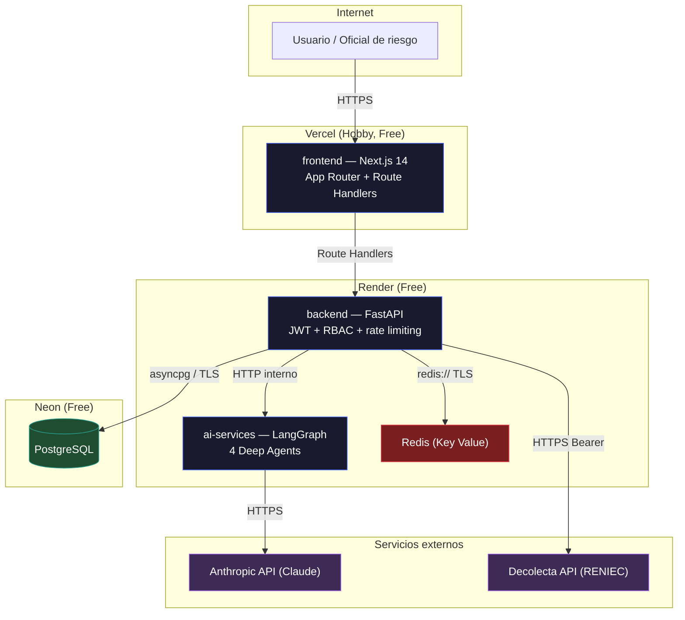

# CLOUD BANK

Sistema multiagente de evaluación de crédito personal. Tres servicios
independientes — `frontend` (Next.js), `backend` (FastAPI) y `ai-services`
(LangGraph + 4 Deep Agents sobre Claude) — con verificación de identidad
real contra RENIEC (Perú) vía Decolecta.

## Arquitectura de servicios

| Servicio | Stack | Responsabilidad |
|---|---|---|
| [`frontend/`](frontend) | Next.js 14 (App Router) + TypeScript + Tailwind | Login de oficiales, formulario de solicitud, consulta de estado. Único punto de contacto del usuario — nunca toca la base de datos ni el LLM directamente. |
| [`backend/`](backend) | FastAPI + Pydantic v2, Clean Architecture | API REST, persistencia (PostgreSQL), seguridad (JWT + API Key, RBAC, rate limiting), verificación de DNI/RENIEC. |
| [`ai-services/`](ai-services) | LangGraph + LangChain | Motor de IA: 4 Deep Agents (fraude, historial crediticio, actuarial, aprobación) sobre Anthropic Claude. |

Cada carpeta tiene su propio `README.md` con instrucciones para correrla de
forma independiente.

## Cómo correrlo en local

```bash
cd infrastructure
docker compose up -d --build
```

Levanta los 3 servicios + PostgreSQL, Redis, Prometheus, Grafana, Jaeger y
mocks de servicios externos (bureau de crédito, biometría, AML, device
intelligence). Ver [`infrastructure/docker-compose.yml`](infrastructure/docker-compose.yml).

## Infraestructura de despliegue (producción)

Desplegado en Vercel (frontend) + Render (backend, ai-services, Redis) +
Neon (PostgreSQL), con las imágenes publicadas en Docker Hub.



Diagrama completo (incluye secuencia de despliegue, tabla de servicios y
limitaciones conocidas) en
[`docs/diagrams/DEPLOYMENT_INFRASTRUCTURE.md`](docs/diagrams/DEPLOYMENT_INFRASTRUCTURE.md).

## Documentación

- [`docs/MASTER_ARCHITECTURE.md`](docs/MASTER_ARCHITECTURE.md) — arquitectura empresarial de referencia (Fase 2).
- [`docs/FREE_TIER_ARCHITECTURE.md`](docs/FREE_TIER_ARCHITECTURE.md) — arquitectura académica free-tier (Fase 1).
- [`docs/SERVICE_CONTRACTS.md`](docs/SERVICE_CONTRACTS.md) — contrato de API entre servicios.
- [`docs/diagrams/ARCHITECTURE.md`](docs/diagrams/ARCHITECTURE.md) — diagrama lógico del pipeline de agentes.
- [`docs/diagrams/DEPLOYMENT_INFRASTRUCTURE.md`](docs/diagrams/DEPLOYMENT_INFRASTRUCTURE.md) — infraestructura de despliegue real.
