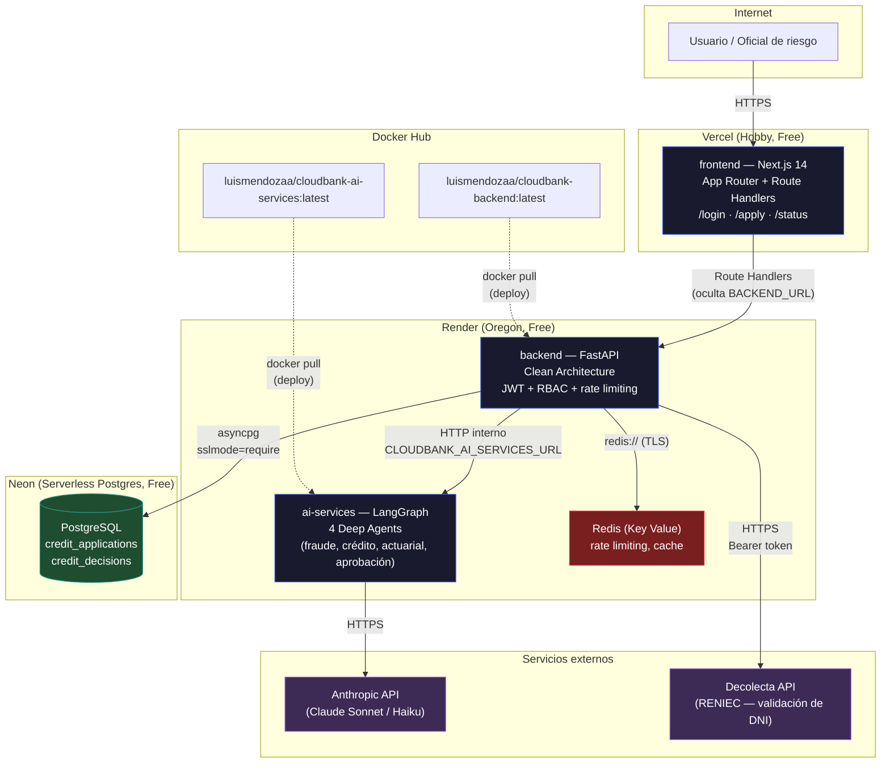
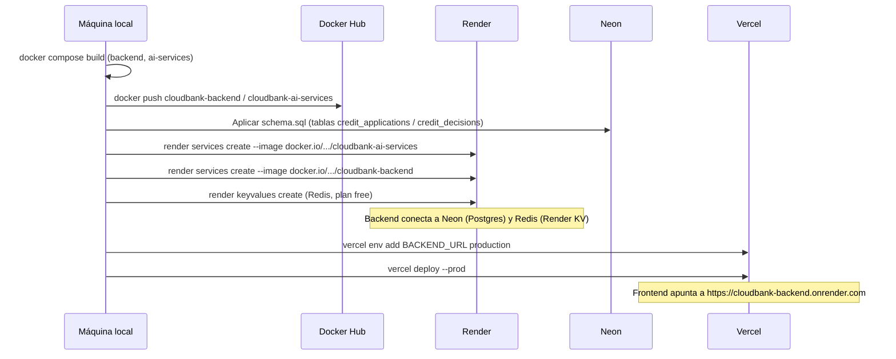

# CLOUD BANK — Infraestructura de Despliegue Real (Producción)

Este diagrama documenta el despliegue efectivamente realizado (a diferencia de
`FREE_TIER_ARCHITECTURE.md`, que es el plan de referencia). Stack: Vercel +
Render + Neon, con las imágenes de `backend`/`ai-services` publicadas en
Docker Hub.

## Diagrama de infraestructura

## Flujo de despliegue (CI manual — sin GitHub Actions todavía)

## Servicios y su función

| Servicio | Plataforma | Plan | Función |
|---|---|---|---|
| `frontend` | Vercel | Hobby (Free) | UI Next.js, Route Handlers como proxy al backend |
| `backend` | Render (Web Service) | Free | API REST, autenticación JWT, persistencia |
| `ai-services` | Render (Web Service) | Free | Pipeline LangGraph de 4 Deep Agents sobre Claude |
| Redis | Render (Key Value) | Free | Rate limiting, cache de sesión |
| PostgreSQL | Neon | Free (0.5 GB) | Persistencia de solicitudes y decisiones de crédito |
| Registro de imágenes | Docker Hub | Free | Origen de las imágenes que Render despliega |
| LLM | Anthropic API | Pay-as-you-go | Razonamiento de los 4 agentes de IA |
| Verificación de identidad | Decolecta API | Free tier | Consulta RENIEC por DNI (Perú) |

## Limitaciones conocidas de este despliegue

- **`ai-services` es públicamente accesible** sin autenticación propia (limitación
  del plan free de Render, que no permite servicios privados). Ver mejora
  propuesta: header `X-Internal-Key` compartido entre `backend` y `ai-services`.
- **Cold start**: los servicios de Render (plan free) "duermen" tras ~15 min de
  inactividad; el primer request posterior puede tardar 30–50s.
- **Sin CI/CD**: el despliegue es manual (build → push → `render services
  create/update` → `vercel deploy`). No hay pipeline de GitHub Actions que
  automatice este flujo todavía.
- **Observabilidad reducida en producción**: Jaeger/Prometheus/Grafana solo
  corren en el `docker-compose.yml` local; en Render/Vercel no hay stack de
  observabilidad conectado (`CLOUDBANK_OBS_TRACING_ENABLED=false`).
